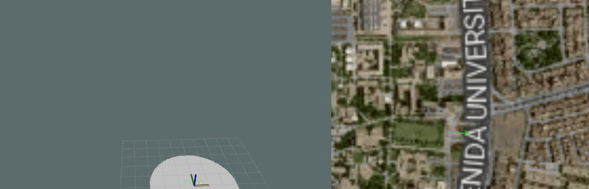

# Tarea: Navegación con Robot de Delivery en PUCP



## Contexto del Escenario

Eres parte del equipo de desarrollo de un robot de delivery autónomo **Avular Origin One** que está comenzando sus operaciones en el campus de la Pontificia Universidad Católica del Perú (PUCP). El robot ha sido diseñado para realizar entregas de manera autónoma utilizando navegación GPS y SLAM.

### Escenario de Operación

El robot inicia sus operaciones desde el **punto KTO** (punto inicial de operaciones) y tiene sus dos primeros pedidos asignados:

1. **McGregor**: Entrega en el edificio McGregor
2. **PUCPCraft**: Entrega en el local PUCPCraft

Después de completar ambas entregas, el robot debe regresar al punto inicial (KTO) para recibir nuevas órdenes.


## Robot: Avular Origin One

Asuma que el **Avular Origin One** es un robot móvil diseñado para operaciones de delivery en entornos urbanos y semi-urbanos. Está equipado con:

- **GPS (GNSS)**: Para localización global
- **IMU**: Para estimación de orientación y movimiento
- **Lidar 2D**: Para detección de obstáculos y SLAM
- **Sistema de navegación Nav2**: Para planificación y control de trayectorias

## Setup
- A continuación, instrucciones de instalación de algunos paquetes requeridos:
```bash
   sudo apt install ros-humble-topic-tools
   sudo apt install ros-humble-robot-localization
   sudo apt-get install ros-humble-navigation2 ros-humble-nav2-bringup
   ```
- En caso desees visualizar el mapa en tiempo real como el gif inicial (OPCIONAL), instala mapviz con:
```bash
   sudo apt-get install ros-$ROS_DISTRO-mapviz \
   ros-$ROS_DISTRO-mapviz-plugins \
   ros-$ROS_DISTRO-tile-map \
   ros-$ROS_DISTRO-multires-image
   ```
Luego sustituye API_KEY_ESTUDIANTE del archivo `avular_kalman_slam/gps_wpf_demo.mvc` con la llave que obtendrás al crearte una cuenta en `https://stadiamaps.com/`.
- Descarga el paquete que contiene los archivos del robot actualizados con un sensor lidar 2d:
```bash
   git clone https://github.com/zetanschy/avular_origin_description.git
   ```
## Ejercicios del Laboratorio

### Ejercicio 1: Filtros de Kalman para Localización en Deliveries

**Objetivo**: Implementar y evaluar diferentes configuraciones de filtros de Kalman para mejorar la localización del robot durante las entregas.

#### Tarea 1.1: Waypoint Follower con Nav2 Plugin

En anteriores clases, aprendimos cómo seguir waypoints usando control directo. Ahora examina el archivo `scripts/gps_waypoint_follower.py` que utiliza el plugin nav2_waypoint_follower de Nav2 para entender cómo funciona la integración con el sistema de navegación.

*Preguntas interpretativas a responder*:
   - En las líneas 110-111, el script crea un ActionClient para el topic 'follow_waypoints' usando el tipo FollowWaypoints. ¿Por qué Nav2 utiliza un *action server* en lugar de un simple publisher/subscriber para el seguimiento de waypoints? ¿Qué ventajas ofrece el patrón de acciones (actions) para esta tarea específica?
   - En las líneas 235-243, el script envía un goal al action server con una lista de PoseStamped y un callback de feedback. ¿Qué información proporciona el feedback_callback durante la ejecución? ¿Por qué es útil tener feedback en tiempo real cuando el robot está siguiendo múltiples waypoints en una ruta de entregas?

**Archivos relevantes**:
- `scripts/gps_waypoint_follower.py`
- `config/pucp_waypoints.yaml` - Waypoints GPS definidos

#### Tarea 1.2: Localización con Solo Wheel Odometry

1. Completa `config/ekf.yaml` para usar **solo wheel odometry** (sin IMU, sin GPS):
   - Considera que el tópico de la odometría con ruedas es: `/robot/odom`
   - Mantén solo `odom0` con wheel odometry, puedes comentar la sección de IMU

2. Lanza el sistema con esta configuración:
   ```bash
   ros2 launch avular_kalman_slam bringup.launch.py filter_type:=ekf
   ```

3. Ejecuta el waypoint follower para completar la ruta de entregas:
   ```bash
   ros2 run avular_kalman_slam gps_waypoint_follower.py
   ```

4. Opcionalmente visualiza el mapa en stadia con los frames del robot usando:
   ```bash
   ros2 launch avular_kalman_slam mapviz.launch.py
   ```

5. **Pregunta a responder**:
   - ¿El robot regresa al mismo punto inicial (KTO) después de completar las entregas? ¿Por qué sí o por qué no?
   - ¿Cuál es la principal limitación de usar solo wheel odometry?

#### Tarea 1.3: Agregar IMU a la Localización

1. Completa `config/ekf.yaml` para agregar **IMU** además de wheel odometry.

2. Lanza el sistema y ejecuta la ruta de entregas nuevamente:
   ```bash
   ros2 launch avular_kalman_slam bringup.launch.py filter_type:=ekf
   ros2 run avular_kalman_slam gps_waypoint_follower.py
   ```

3. **Preguntas a responder**:
   - ¿Mejora la localización al agregar IMU? ¿Por qué?
   - ¿El robot regresa mejor al punto inicial comparado con solo wheel odometry?

#### Tarea 1.4: Implementar Dual EKF con GPS

El GPS es clave en deliveries porque aporta una referencia absoluta de posición en el mundo. Esa referencia permite corregir el drift que inevitablemente se acumula al integrar **wheel odometry + IMU** en trayectos largos. Sin GPS, el robot puede moverse “bien” localmente, pero su pose **se desplaza globalmente** con el tiempo, afectando el seguimiento de waypoints y la consistencia con un mapa global. 

En este caso particular de simulación los resultados pueden no variar respecto al apartado 1.3, sin embargo, en una aplicación en la vida real donde hay mayor ruido, resulta más conveniente. En ROS 2, esto se implementa de forma robusta con un **Dual EKF** (robot_localization) para separar dos necesidades distintas:

- **Estimación local (`odom`)**: debe ser suave y continua (útil para control y planificación local). Aquí se fusionan sensores de alta frecuencia como wheel odom + IMU.
- **Estimación global (`map`)**: debe ser globalmente consistente y corregir drift con sensores absolutos (GPS). Esta corrección debe afectar el *marco global*, no la odometría local.

**Idea clave de TF:**

- EKF local publica: `odom → base_link` (suave, deriva con el tiempo)
- EKF global publica: `map → odom` (corrige drift global usando GPS)

1. Modifica `config/dual_ekf.yaml` para completar la configuración de **Dual EKF con GPS**:
   - Completa el EKF del frame `odom` que está configurado con wheel odometry + IMU
   - Completa el EKF del frame `map`:
     - Considera que en el archivo `launch/localization.launch.py`, se hace un mapeo tal que el output de la odometría local es `/odometry/local`

2. Lanza el sistema con Dual EKF:
   ```bash
   ros2 launch avular_kalman_slam bringup.launch.py filter_type:=dual_ekf
   ros2 run avular_kalman_slam gps_waypoint_follower.py
   ```
---

### Ejercicio 2: Mapeo SLAM de la Zona de Operaciones

**Objetivo**: Realizar un mapeo completo de la zona de operaciones usando SLAM Toolbox para futuros deliveries.

#### Contexto

El campus PUCP está en proceso de reconstrucción y necesitas crear un mapa actualizado de la zona donde operará el robot para futuros deliveries. El mundo de simulación `slam_world.world` representa esta zona con nuevos obstáculos y estructuras que deben ser mapeados.

#### Realizar el Mapeo con SLAM Toolbox

1. Lanza el sistema con SLAM:
   ```bash
   ros2 launch avular_kalman_slam bringup_slam.launch.py
   ```

2. Mueve el robot manualmente para mapear toda el área:
   ```bash
   # Teleoperación del robot
   ros2 run teleop_twist_keyboard teleop_twist_keyboard --ros-args -r /cmd_vel:=/robot/cmd_vel
   ```

3. Guarda el mapa usando el comando:
   ```bash
   ros2 run nav2_map_server map_saver_cli -f my_map
   ```
---

### Entregables: 
Entregar comprimido en un archivo zip:

- Mapa generado en formato pgm o png.

- Archivos de configuración ekf y dual_ekf.yaml

- Readme con respuestas a las preguntas de análisis.
